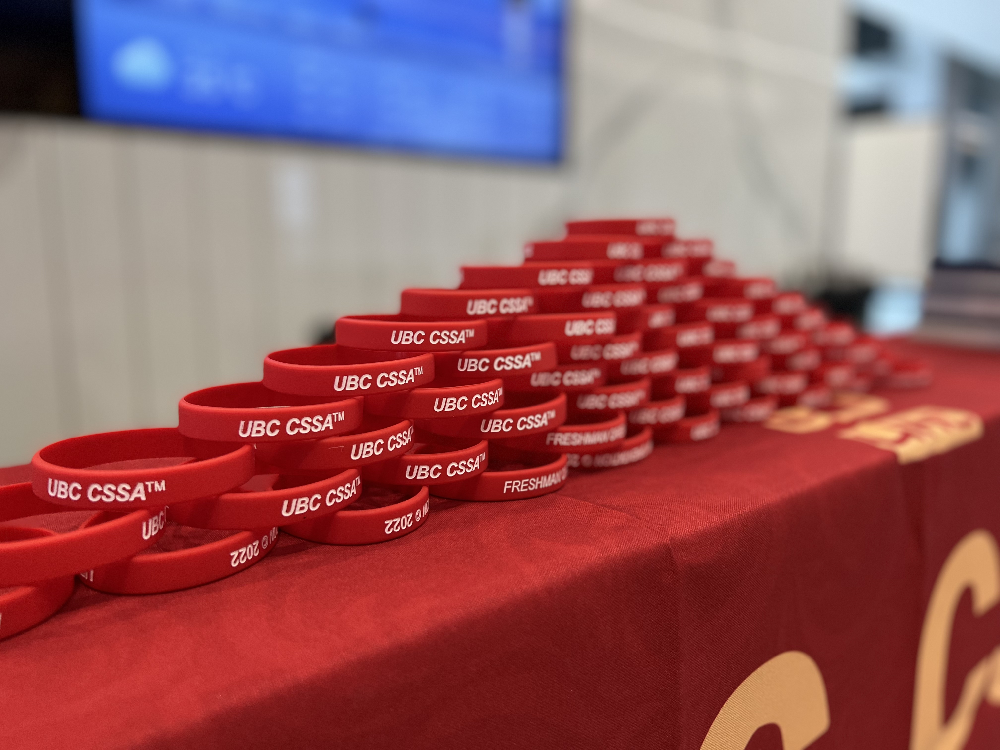

    

<h1 align="center">UBC CSSA</h1>

Official Website for Chinese Students And Scholars Association based on CSI GITAM Student Branch's work

    <a href="https://www.ubccssa.com" target="_blank"> Visit our website :rocket:</a>

    

    <em>Built with Bootstrap 4 & Sass, powered by <a href="https://pages.github.com/" target="_blank">GitHub Pages</a> and  <a href="https://vercel.com/" target="_blank">Vercel</a>.</em>

## Contributing

1. [Raise an issue](https://github.com/ubc-cssa/ubccssa.github.io/issues/new). Add relevant details to help us understand the issue/feature request.
2. [Fork](https://github.com/ubc-cssa/ubccssa.github.io/fork) this repository.
3. Create your feature/issue branch (`git checkout -b feature/yourfeature`).
4. Commit your changes (`git commit -am 'Add some yourfeature'`).
4. Push to the branch (`git push origin feature/yourfeature`)
5. Create a new Pull Request.

> Please [raise an issue](https://github.com/ubc-cssa/ubccssa.github.io/issues/new) or contact us before submitting a Pull Request since we can not accept PRs without verifying its validity.

## Feedback

Show your support by starring this repository and feel free to [raise an issue](https://github.com/ubc-cssa/ubccssa.github.io/issues/new). Feature requests are always welcome. If there's anything you'd like to talk about, please feel free to contact us on [Facebook](https://www.facebook.com/ubccssa/)!

## Licensing

The content of this project itself is licensed under the [Creative Commons Attribution-ShareAlike 4.0 International Public License](https://creativecommons.org/licenses/by-sa/4.0/), and the underlying source code used to format and display that content is licensed under the [MIT License](https://opensource.org/licenses/MIT). See [`LICENSE`](https://github.com/ubc-cssa/ubccssa.github.io/blob/master/LICENSE) for more information.
